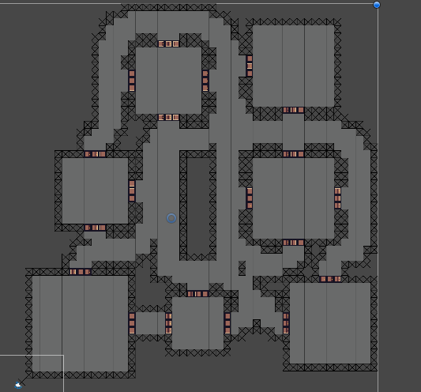
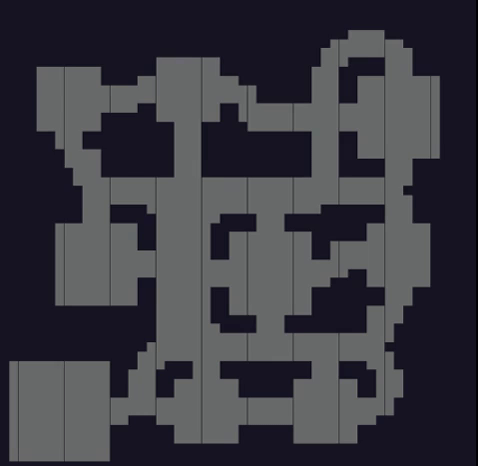
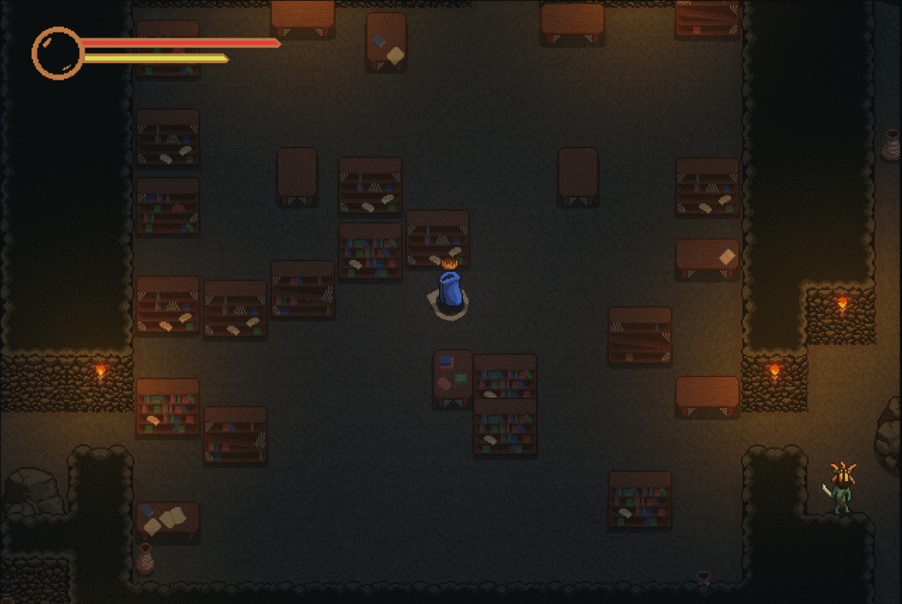
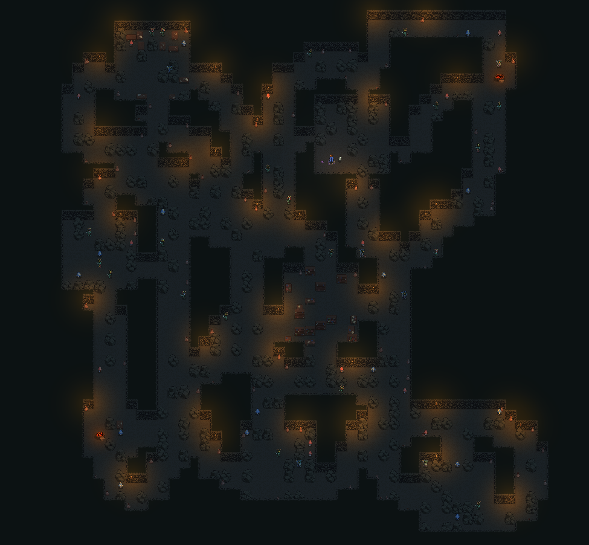

# Untitled Roguelike Demo
##### By Matthew Caccavelli

A small demonstration of some features of a roguelike game that is currently in development.
This game is made in its entirety by Matthew Caccavelli, including all code, art, sfx and music.
Developed in Unity, using Aseprite for art and Logic Pro X for sound design and music composition.

This game is still very much in development, and many features will not be explicitly demonstrated here. The core systems of the game which will be demonstrated, being level generation and combat, have been implemented and designed in such a way that their extension is extremely streamlined and simple. Thus, the immediate focus of development going forward is additional content for these systems, such as the design of new level elements, enemies, items and combat features, which will be especially art-heavy. I hope to publicly release a playable demo soon.

## Level Generation

The first and arguably most important aspect of the game that was designed was level generation. I decided that it would be best for the levels to be as random and unpredictable as possible, while still allowing me to properly tailor the feel and composition of the generation and deliver a consistent experience to the player. To do this, I designed a multi-stage generation system with all the customizability I could think of. This design breaks the problem into 3 stages which I call generation, population and decoration, and each will be detailed below.

### Generation

The “generation” section of the system consists of the generation of the layout of the level, which includes the positions and sizes of the rooms and hallways. This algorithm also decides what type of room each room will be, according to the special types specified, and returns a 2d array mapping each tile. This array is generated by first placing rooms at random locations and deciding their size using a perlin noise function applied to a size range. Once enough rooms have been made, the algorithm then connects these rooms with hallways using A* pathfinding. Then, using pathfinding again, the generation is checked to make sure that all the rooms are connected and the map is then returned.

\
A visual representation of a generated map. The light grey tiles being the floor, orange tiles being doorways and black tiles being walls. 

#### Generation Settings
The algorithm also has many settings that can be saved into a preset and can drastically affect the outcome. These settings are listed and briefly explained below.

* __Floor Size__: Specifies the total dimensions of the level in tiles.
* __Room Overlap__: Specifies how close rooms can be placed to one another. Negative values ensure a minimum distance between the edges of rooms and positive values allow overlap.
* __Room Crossing__: If true, hallways are allowed to pass through rooms.
* __Hall Crossing__: If true, hallways are allowed to cross over one another.
* __Force Room Count__: If true, will attempt to add as many rooms as possible until the limit is reached. To do this, after random room placement the algorithm will iterate through all possible spots and room sizes, adding a room at any possible spot.
* __Room Min/Max__: Specifies the minimum and maximum possible size of a room.
* __Hall Min/Max__: Specifies the minimum and maximum possible width of hallways.
* __Door Offset__: Specifies the maximum possible amount a doorway can be misaligned from the center of a room.
* __Uniform Doors__: If true, all doorways will share the same random offset.
* __Tunnel Count__: Specifies how many hallways a doorway will attempt to make to other doorways.
* __Special Rooms__: A list of special room types to include in the generation. These rooms will be assigned first, and the remaining generated rooms will be the default type.
* __Fill Percent__: A stop condition for room generation. Once the specified percent of the total tiles have been filled by rooms, no new rooms will be added and the generator will begin generating the halls.
* __Room Limit__:  A stop condition for room generation. Once the specified amount of rooms have been made, no new rooms will be added and the generator will begin generating the halls.
* __Perlin Scale__: Scales the perlin noise sampling to be used when deciding size of rooms.

\
A gif demonstrating some possible layouts of the generation using different settings.

### Population
The “population” section handles everything concerning filling the generated rooms and hallways with content. This includes obstacles and special objects as well as enemies. The algorithm for this section uses small groups of objects and places them within the desired area. These groups are organized based on what is being populated, meaning different room types are populated by different objects. The hallways are populated in a similar manner while taking special care to not block circulation. 

Additionally, all room types and hallways are given a specified challenge rating, which will spawn random enemies until the target challenge level is reached. The algorithm ensures that a relatively consistent level of difficulty is achieved across generations while allowing specific areas to be more challenging than others.

\
A gif demonstrating different outcomes of room population. Ignore the placement of the pots and torches, as these are handled by the decorator and will be discussed next.
(enemies are in their spawn locations)

### Decoration
The final section of the generation consists of the "decoration" of the level. This section includes the placement of the tiles for the floor and walls as well as the random placement of extra objects throughout the level, such as torches. The decorator operates by iterating through a list of decoration modules and running them on the populated level. Multiple algorithms are possible, but I will briefly explain the 2 that are currently being used in the demo material.

#### Smoothing Decorator
This module works by iterating through all tiles of a specific type and adding decorations on those which are neighbouring tiles of another specified type. In the examples shown here, this is what is used to place the pottery throughout the level. It targets floor tiles and places pots next to the tiles which are neighbouring a wall, increasing the amount placed if the tile is neighbouring several walls.

#### Zoned Decorator
This module works by placing a specified amount of elements in each zone of a specified size. The module will iterate through each zone and find the eligible tiles to place the decorations. This is what is used to place the torches throughout the level. In this situation, every 5x5 chunk of tiles will contain a torch, which guarantees consistent lighting throughout the level.

\
A demonstration of torch placement in a generated level.

### Efficiency
This generation system is extremely modular and versatile. For this reason, the time needed to generate a level can vary depending on the specific settings and elements provided. However, it is still more than fast enough while also providing a large amount of randomization and replayability. 

\
Live example of the full generation being run multiple times demonstrating the speed.
(taken from within Unity editor)

## Combat
Another crucial game system that will be demonstrated is combat. The base code and groundwork for how combat will work has been written, and the main work remaining to be done is the design of different attacks and items to increase gameplay diversity and replayability. I wanted to ensure that I had as much design space as possible, especially for player items. To accomplish this, coroutines were leveraged to spread the handling of attacks across several frames. Due to this setup, special triggers granted by items can occur at several positions in this process, such as starting an attack, being hit with an attack, hitting an attack, successfully defending an attack, and many others, all while ensuring smooth gameplay. There is still a lot of work to be done to further develop and expand on this system, however I’ve included examples below demonstrating the basic gameplay.

  
